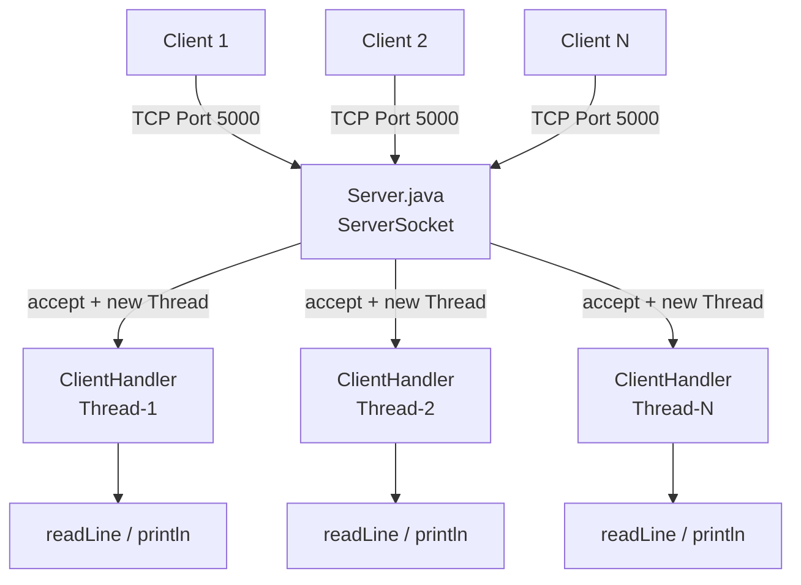
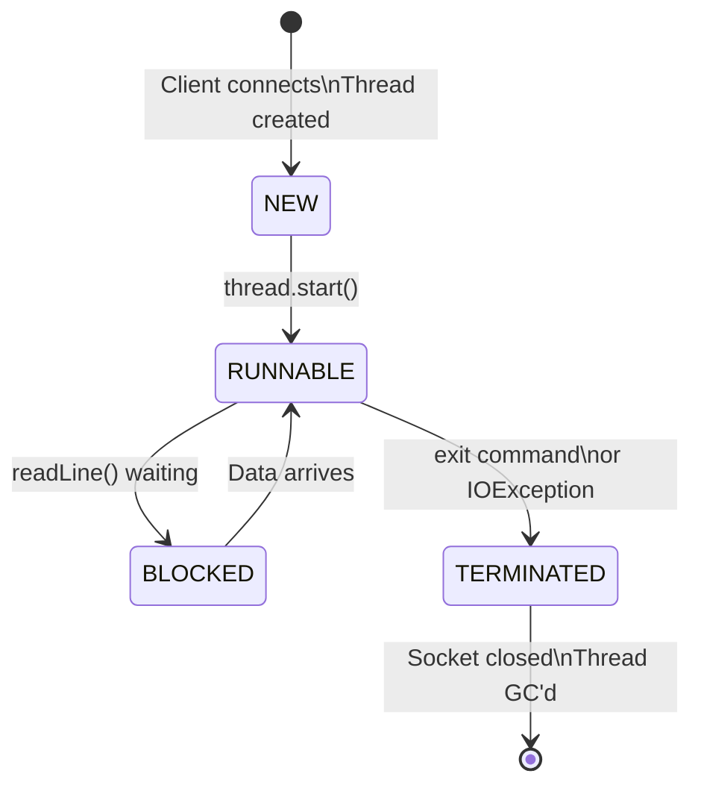
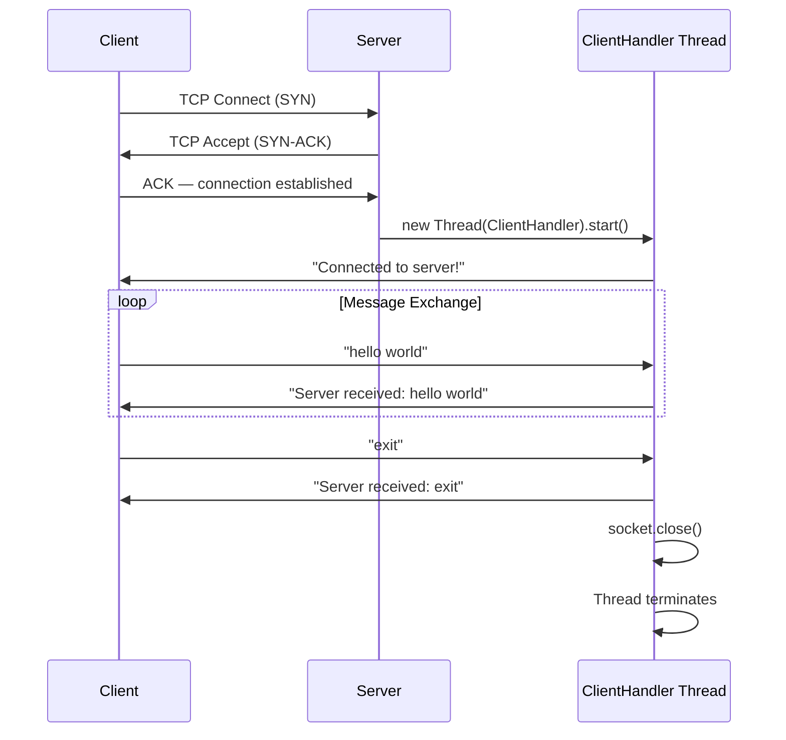
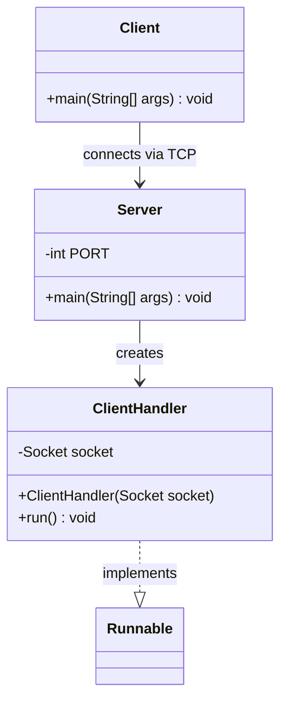
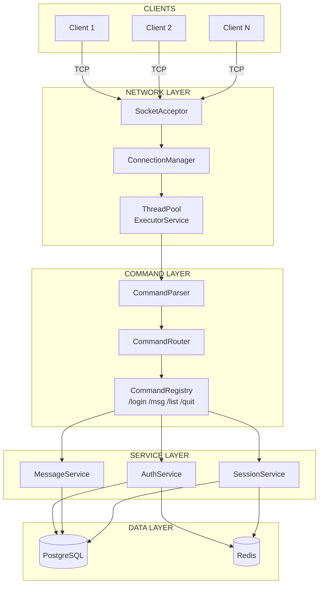
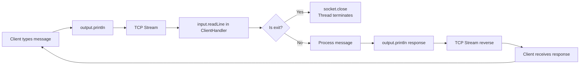
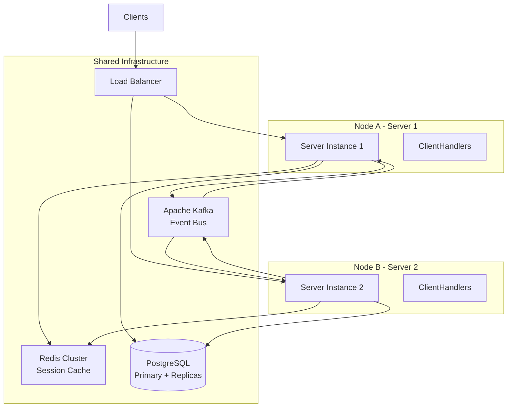

# System Diagrams

**Project:** Distributed Multithreaded Secure Server Platform
**Version:** 0.2.0 | **Date:** 2026-05-18

All diagrams are written in Mermaid format. GitHub renders these automatically.
Use [mermaid.live](https://mermaid.live) to preview locally.

---

## 1. High-Level Architecture Diagram

---

## 2. Thread Lifecycle Diagram

---

## 3. Connection Sequence Diagram

---

## 4. Class Diagram (Current)

---

## 5. Target Architecture Diagram (Level 4+)

---

## 6. Data Flow Diagram

---

## 7. Future: Distributed Architecture (Level 12+)

